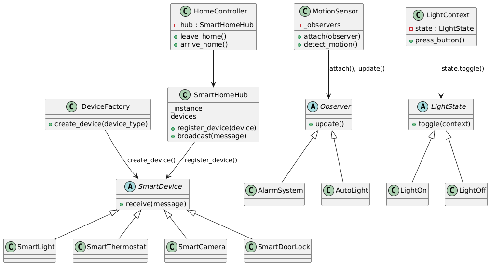

<div align="center">
  <h1>Smart Home Patterns</h1>
  <p><em>5 Design Patterns in Python for a Unified Smart Home Scenario</em></p>
</div>

This repository demonstrates 5 classical software design patterns, all implemented within the context of a **Smart Home Automation System**. The project is developed for the **Software and Systems Engineering Course**.

All patterns are implemented in a **single Python file**: [`smart_home_patterns.py`](./smart_home_patterns.py).

Each design pattern is:
- clearly marked in the source code;
- explained with dedicated sections in this README;
- accompanied by UML diagrams for visualization;
- observable through labeled console outputs (e.g., `[Singleton]`, `[Observer]`).


### :file_folder: Repository Structure

| Path                   | Description                                  |
|------------------------|----------------------------------------------|
| `smart_home_patterns.py` | Main Python file with all 5 design patterns   |
| `uml/`                 | UML diagrams for each pattern + general overview |


## :brain: Implemented Design Patterns Overview

| Pattern           | Type         | Applied To                 | Section |
|------------------|--------------|----------------------------|---------|
| Singleton         | Creational   | Central SmartHomeHub       | [Link](#1-singleton--smarthomehub) |
| Factory Method    | Creational   | Device creation logic      | [Link](#2-factory-method--devicefactory) |
| Facade            | Structural   | Unified home control       | [Link](#3-facade--homecontroller) |
| Observer          | Behavioral   | Motion detection system    | [Link](#4-observer--motionsensor-and-devices) |
| State             | Behavioral   | Smart light state machine  | [Link](#5-state--smartlight) |


## :bar_chart: General UML Diagram

The following overview illustrates how all classes interact:




## 1. Singleton – `SmartHomeHub`

### :pushpin: Description
The Singleton pattern ensures that a class has only one instance and provides a global access point to it.

In this project, `SmartHomeHub` acts as the centralized message broker. All smart devices are registered to this hub, which sends broadcast messages to all connected devices. This prevents multiple hubs from being accidentally created, ensuring consistent coordination.

### :bulb: Use Case
- Prevent multiple central controllers.
- Coordinate messages across all devices in the system.

### :jigsaw: Code Snippet

```python
class SmartHomeHub:
    _instance = None

    def __new__(cls):
        if cls._instance is None:
            cls._instance = super().__new__(cls)
            cls._instance.devices = []
            print("[Singleton] Creating SmartHomeHub instance")
        return cls._instance

    def register_device(self, device):
        self.devices.append(device)

    def broadcast(self, message):
        print(f"[Singleton] Broadcasting: {message}")
        for device in self.devices:
            device.receive(message)
```

### :desktop_computer: Example Output

```
[Singleton] Creating SmartHomeHub instance
[Singleton] Broadcasting: lock_doors
[Singleton] Broadcasting: turn_off_lights
[Singleton] Broadcasting: activate_cameras
[Singleton] Broadcasting: unlock_doors
[Singleton] Broadcasting: turn_on_lights
```

### :card_index_dividers: UML


## 2. Factory Method – `DeviceFactory`

### 📌 Description
The Factory Method pattern defines an interface for creating objects but allows subclasses to alter the type of objects that will be created.

In our smart home, we use the `DeviceFactory` class to create different device types (`SmartLight`, `SmartCamera`, etc.) depending on a string identifier. This separates creation logic from usage logic.

### 💡 Use Case
- Easily instantiate various devices.
- Add new device types without changing the client code.

### :jigsaw: Code Snippet

```python
class SmartDevice:
    def receive(self, message):
        raise NotImplementedError()

class SmartLight(SmartDevice):
    def receive(self, message):
        print(f"[SmartLight] received: {message}")

class SmartThermostat(SmartDevice):
    def receive(self, message):
        print(f"[SmartThermostat] received: {message}")

class SmartCamera(SmartDevice):
    def receive(self, message):
        print(f"[SmartCamera] received: {message}")

class SmartDoorLock(SmartDevice):
    def receive(self, message):
        print(f"[SmartDoorLock] received: {message}")

class DeviceFactory:
    def create_device(self, device_type):
        print(f"[FactoryMethod] Creating device of type: {device_type}")
        if device_type == "light":
            return SmartLight()
        elif device_type == "thermostat":
            return SmartThermostat()
        elif device_type == "camera":
            return SmartCamera()
        elif device_type == "doorlock":
            return SmartDoorLock()
        else:
            raise ValueError("Unknown device type")
```

### :desktop_computer: Example Output

```
[FactoryMethod] Creating device of type: light
[FactoryMethod] Creating device of type: thermostat
...
[SmartLight] received: lock_doors
[SmartThermostat] received: lock_doors
...
[SmartLight] received: turn_off_lights
[SmartThermostat] received: turn_off_lights
...
[SmartLight] received: activate_cameras
[SmartThermostat] received: activate_cameras
...
[SmartLight] received: unlock_doors
[SmartThermostat] received: unlock_doors
...
[SmartLight] received: turn_on_lights
[SmartThermostat] received: turn_on_lights
...
[SmartLight] received: deactivate_cameras
[SmartThermostat] received: deactivate_cameras
```

### :card_index_dividers: UML


## 3. Facade – `HomeController`

### 📌 Description
The Facade pattern provides a simplified interface to a larger body of code.

In this case, `HomeController` wraps complex device commands and provides single methods like `leave_home()` or `arrive_home()`.

### 💡 Use Case
- Manage complex sequences of commands with one method call.
- Simplify client code interaction.

### :jigsaw: Code Snippet

```python
class HomeController:
    def __init__(self):
        self.hub = SmartHomeHub()

    def leave_home(self):
        print("[Facade] Activating leave_home mode...")
        self.hub.broadcast("lock_doors")
        self.hub.broadcast("turn_off_lights")
        self.hub.broadcast("activate_cameras")

    def arrive_home(self):
        print("[Facade] Activating arrive_home mode...")
        self.hub.broadcast("unlock_doors")
        self.hub.broadcast("turn_on_lights")
        self.hub.broadcast("deactivate_cameras")
```

### :desktop_computer: Example Output

```
[Facade] Activating leave_home mode...
[Singleton] Broadcasting: lock_doors
[Singleton] Broadcasting: turn_off_lights
[Singleton] Broadcasting: activate_cameras

[Facade] Activating arrive_home mode...
[Singleton] Broadcasting: unlock_doors
[Singleton] Broadcasting: turn_on_lights
[Singleton] Broadcasting: deactivate_cameras
```

### :card_index_dividers: UML


## 4. Observer – `MotionSensor` and Devices

### 📌 Description
The Observer pattern defines a one-to-many dependency between objects so that when one object changes state, all its dependents are notified.

`MotionSensor` notifies its observers (`AlarmSystem`, `AutoLight`) when it detects movement.

### 💡 Use Case
- Real-time event notifications.
- Loosely coupled interaction between sensor and devices.

### :jigsaw: Code Snippet

```python
class Observer:
    def update(self):
        raise NotImplementedError()

class MotionSensor:
    def __init__(self):
        self._observers = []

    def attach(self, observer):
        print(f"[Observer] Attaching {observer.__class__.__name__}")
        self._observers.append(observer)

    def detect_motion(self):
        print("[Observer] Motion detected!")
        for observer in self._observers:
            observer.update()

class AlarmSystem(Observer):
    def update(self):
        print("[AlarmSystem] Intrusion detected!")

class AutoLight(Observer):
    def update(self):
        print("[AutoLight] Turning on light due to motion")
```

### :desktop_computer: Example Output

```
[Observer] Attaching AlarmSystem
[Observer] Attaching AutoLight
[Observer] Motion detected!
[AlarmSystem] Intrusion detected!
[AutoLight] Turning on light due to motion
```

### :card_index_dividers: UML


## 5. State – `SmartLight`

### 📌 Description
The State pattern allows an object to alter its behavior when its internal state changes. The object appears to change its class.

Our `LightContext` contains a current state, and pressing the button toggles between `LightOn` and `LightOff`.

### 💡 Use Case
- Avoid long `if-elif` chains.
- Encapsulate state transitions and behavior.

### :jigsaw: Code Snippet

```python
class LightState:
    def toggle(self, context):
        raise NotImplementedError()

class LightOn(LightState):
    def toggle(self, context):
        print("[State] Switching light OFF")
        context.state = LightOff()

class LightOff(LightState):
    def toggle(self, context):
        print("[State] Switching light ON")
        context.state = LightOn()

class LightContext:
    def __init__(self):
        self.state = LightOff()
        print("[State] Initial light state: OFF")

    def press_button(self):
        print("[State] Button pressed")
        self.state.toggle(self)
```

### :desktop_computer: Example Output

```
[State] Initial light state: OFF
[State] Button pressed
[State] Switching light ON
[State] Button pressed
[State] Switching light OFF
```

### :card_index_dividers: UML


## :arrow_forward: How to Run the Demo

To launch the smart home pattern demo, run:

```bash
python smart_home_patterns.py
```

Each section is prefixed with `[DEMO]` and pattern tags in the terminal for clarity.

## :pen: Repository author

- :woman_technologist: <a href="https://github.com/space13pirate" title="space13pirate">Anastasia Cheremisova</a>
- :mortar_board: Student of KNRTU-KAI
- :round_pushpin: Kazan, Russia

- :mag_right: How to contact me:
<div id="badges" align="center">
  <a href="https://t.me/space13pirate">
    
  </a>
  <a href="https://discord.gg/RHH9qHZJ">
      
  </a>
  <a href="https://vk.com/north13anastasia">
    
  </a>
</div>
